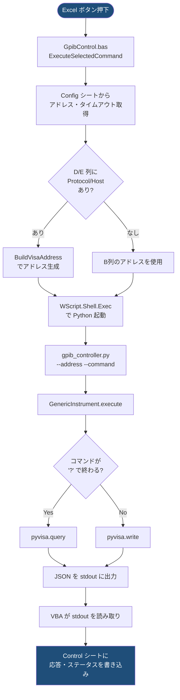
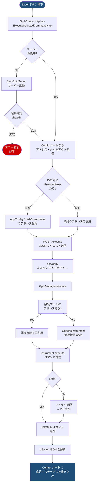
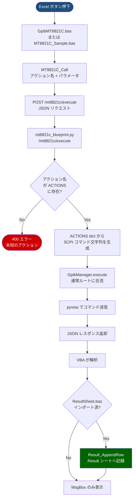
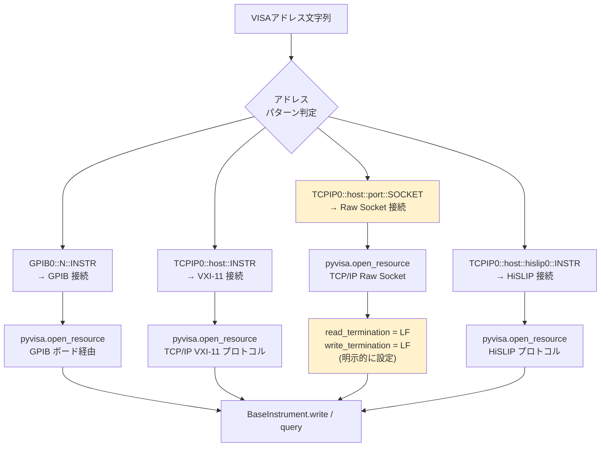
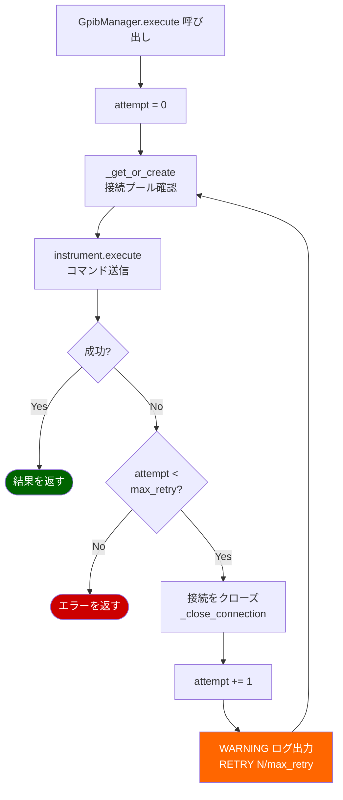
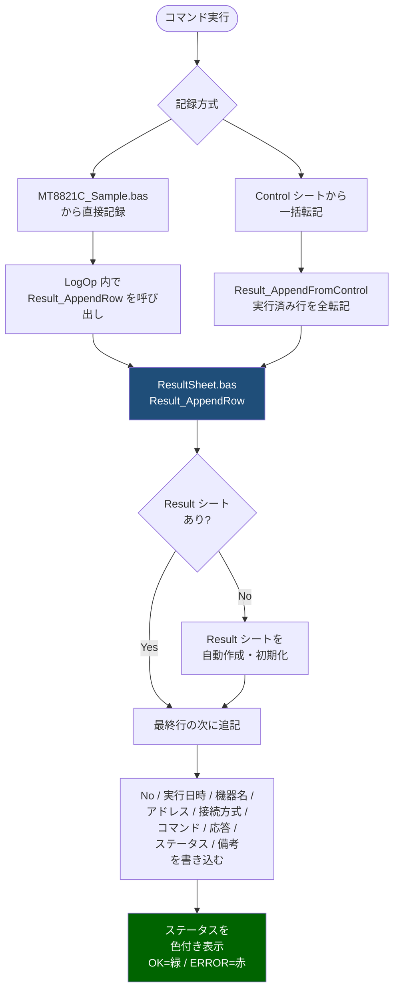
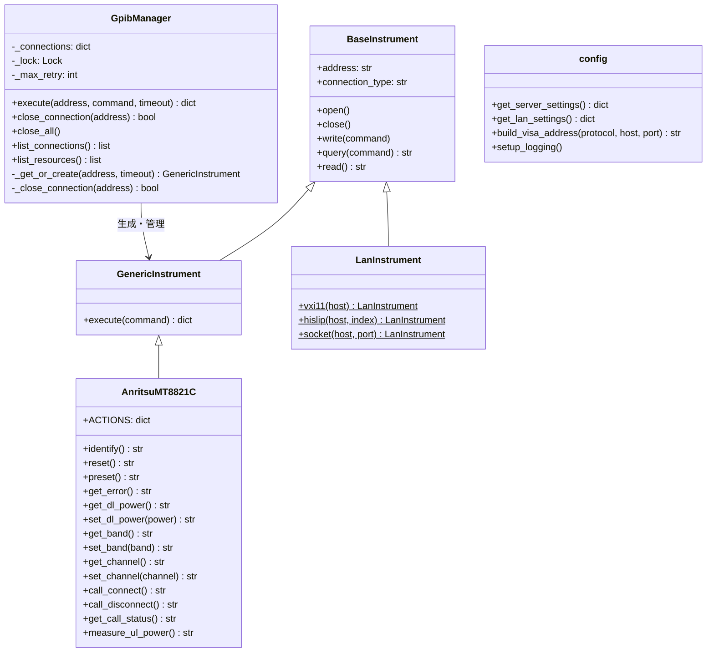
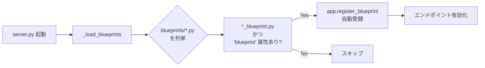

# システム設計書 — operateGPIBFromVBA

## 目次

1. [システム概要](#1-システム概要)
2. [処理ルート](#2-処理ルート)
   - 2.1 [CLI 方式](#21-cli-方式)
   - 2.2 [Flask 方式（通常コマンド）](#22-flask-方式通常コマンド)
   - 2.3 [Flask 方式（MT8821C 専用）](#23-flask-方式mt8821c-専用)
   - 2.4 [LAN 接続の分岐](#24-lan-接続の分岐)
   - 2.5 [リトライ・再接続フロー](#25-リトライ再接続フロー)
   - 2.6 [試験結果の記録フロー](#26-試験結果の記録フロー)
3. [モジュール構成](#3-モジュール構成)
4. [ファイル構成](#4-ファイル構成)
5. [Excel シート仕様](#5-excel-シート仕様)
6. [設定ファイル仕様（settings.ini）](#6-設定ファイル仕様settingsini)
7. [API エンドポイント仕様](#7-api-エンドポイント仕様)
8. [VISA アドレス仕様](#8-visa-アドレス仕様)
9. [プラグイン拡張方式](#9-プラグイン拡張方式)

---

## 1. システム概要

Excel VBA から Python (pyvisa) を経由して GPIB / LAN 機器を制御するシステム。

```
┌─────────────────────────────────────────────────────────┐
│  Excel (VBA)                                            │
│  ┌──────────┐  ┌────────────────┐  ┌─────────────────┐ │
│  │ Config   │  │ Control        │  │ Result          │ │
│  │ シート   │  │ シート         │  │ シート          │ │
│  │ 機器設定 │  │ コマンド実行   │  │ 試験結果記録    │ │
│  └──────────┘  └────────────────┘  └─────────────────┘ │
└───────────────────────┬─────────────────────────────────┘
                        │ 2方式
           ┌────────────┴────────────┐
           │ CLI方式                 │ Flask方式 (推奨)
           ▼                        ▼
   WScript.Shell.Exec()      MSXML2.XMLHTTP
   (プロセス都度起動)          (HTTP POST)
           │                        │
           ▼                        ▼
   gpib_controller.py        server.py (常駐)
           │                        │
           └────────────┬───────────┘
                        ▼
                 pyvisa (VISA ドライバ)
                        │
           ┌────────────┴────────────┐
           ▼                        ▼
      GPIB ボード               LAN (TCP/IP)
           │                        │
           └────────────┬───────────┘
                        ▼
                   計測機器
         (DMM / 電源 / MT8821C 等)
```

### 2 方式の比較

| 項目 | CLI 方式 | Flask 方式 (推奨) |
|------|----------|------------------|
| VBA モジュール | `GpibControl.bas` | `GpibControlHttp.bas` |
| Python 起動 | コマンド毎に起動 | サーバーとして常駐 |
| GPIB 接続 | 毎回 open/close | 接続プールで再利用 |
| リトライ | なし | 失敗時に自動再接続 |
| ログ出力 | なし | ファイル + コンソール |
| 用途 | 試験・デバッグ向け | 本番運用向け |

---

## 2. 処理ルート

### 2.1 CLI 方式



### 2.2 Flask 方式（通常コマンド）



### 2.3 Flask 方式（MT8821C 専用）



### 2.4 LAN 接続の分岐



> **注意:** Raw Socket (`::SOCKET`) のみ終端文字 (`\n`) を明示設定する。
> GPIB / VXI-11 / HiSLIP は pyvisa が自動処理する。

### 2.5 リトライ・再接続フロー



> `max_retry` は `config/settings.ini` の `[Server] MaxRetry` で設定 (デフォルト: 1)。

### 2.6 試験結果の記録フロー



---

## 3. モジュール構成

### Python 側



### VBA 側

```
┌───────────────────────────────────────────────────────┐
│ VBA モジュール依存関係                                  │
│                                                       │
│  AppConfig.bas          設定読み込み (必須)             │
│       ↑ 依存                                          │
│  GpibControlHttp.bas    Flask方式 実行  ─┐            │
│  GpibControl.bas        CLI方式 実行    │ Control     │
│  GpibMT8821C.bas        MT8821C専用    ─┘ シート操作   │
│  MT8821C_Sample.bas     動作確認サンプル  ─┐           │
│       ↓ 呼び出し                          │ Result    │
│  ResultSheet.bas        試験結果管理     ←┘ シート操作  │
└───────────────────────────────────────────────────────┘
```

---

## 4. ファイル構成

```
operateGPIBFromVBA/
│
├── python/                          # Python バックエンド
│   ├── server.py                    # Flask サーバー (エンドポイント定義)
│   ├── gpib_manager.py              # 接続プール・リトライ・スレッドセーフ
│   ├── gpib_controller.py           # [CLI] エントリポイント
│   ├── config.py                    # settings.ini 読み込み・ロギング設定
│   ├── requirements.txt             # pyvisa, pyvisa-py, flask
│   ├── instruments/
│   │   ├── base_instrument.py       # 基底クラス (GPIB/LAN 共通)
│   │   ├── generic_instrument.py    # 汎用機器クラス
│   │   ├── lan_instrument.py        # LAN 接続ファクトリクラス
│   │   └── anritsu_mt8821c.py       # MT8821C 専用クラス (ACTIONS dict)
│   └── blueprints/                  # プラグイン Blueprint
│       └── mt8821c_blueprint.py     # MT8821C 専用エンドポイント
│
├── vba/                             # Excel VBA モジュール (SHIFT-JIS)
│   ├── AppConfig.bas                # INI 読み込み・VISA アドレスビルダー
│   ├── GpibControlHttp.bas          # Flask方式 実行・サーバー起動管理
│   ├── GpibControl.bas              # CLI方式 実行
│   ├── GpibMT8821C.bas              # MT8821C 専用操作
│   ├── MT8821C_Sample.bas           # MT8821C 動作確認サンプル集
│   └── ResultSheet.bas              # 試験結果 Result シート管理
│
├── config/
│   └── settings.ini                 # サーバー設定・LAN設定・ログ設定
│
├── docs/
│   └── system_design.md             # 本ファイル (システム設計書)
│
├── tests/                           # pytest テストスイート
│   ├── conftest.py                  # pyvisa モックフィクスチャ
│   ├── test_config.py               # config.py テスト
│   ├── test_instruments.py          # 機器クラステスト
│   ├── test_gpib_manager.py         # GpibManager テスト
│   └── test_mt8821c.py              # MT8821C テスト
│
├── create_excel.py                  # Excel ファイル生成スクリプト
├── debug_client.py                  # CLI デバッグツール
├── start_server.bat                 # サーバー起動バッチ
├── CLAUDE.md                        # エンコーディング規約
└── README.md                        # セットアップ・操作手順
```

---

## 5. Excel シート仕様

### Config シート（機器設定）

| 列 | 項目 | 必須 | 説明 |
|----|------|------|------|
| A | 機器名 (Name) | ✔ | Control シートの A 列と一致させる |
| B | VISA アドレス | △ | フル指定の場合。D/E 列がある場合は自動生成 |
| C | Timeout (ms) | ✔ | 通信タイムアウト。例: 5000 |
| D | Protocol | △ | `GPIB` / `TCPIP` / `SOCKET` / `HISLIP` |
| E | Host / IP | △ | IPアドレスまたはホスト名 |
| F | Port | △ | Raw Socket の場合のみ必要。例: 5025 |

> D/E 列が入力されている場合は B 列より優先して VISA アドレスを自動生成する。

### Control シート（コマンド実行）

| 列 | 項目 | 説明 |
|----|------|------|
| A | 機器名 | Config シートの A 列と一致させる |
| B | SCPI コマンド | `?` で終わると query、それ以外は write |
| C | 応答結果 | 実行後に自動入力される |
| D | ステータス | `OK` (緑) または `ERROR: メッセージ` (赤) |

### Result シート（試験結果記録）

| 列 | 項目 | 説明 |
|----|------|------|
| A | No. | 通し番号 (自動採番) |
| B | 実行日時 | yyyy/mm/dd hh:mm:ss |
| C | 機器名 | 操作対象の機器名 |
| D | VISA アドレス | 接続に使用したアドレス |
| E | 接続方式 | GPIB / LAN VXI-11 / LAN Socket / LAN HiSLIP |
| F | コマンド / アクション | 実行した SCPI コマンドまたはアクション名 |
| G | 応答結果 | 機器からの応答 |
| H | ステータス | OK (緑) / ERROR (赤) |
| I | 備考 | 「Control転記」「比較確認」など |

---

## 6. 設定ファイル仕様（settings.ini）

```ini
[Server]
Host            = 127.0.0.1        # Flask サーバーのバインドアドレス
Port            = 5000             # Flask サーバーのポート番号
PythonExe       = python           # Python 実行ファイルのパス
ServerScript    = C:\...\server.py # server.py の絶対パス
HealthTimeoutSec = 10              # サーバー起動確認のタイムアウト (秒)
MaxRetry        = 1                # コマンド失敗時の再試行回数

[Logging]
Level       = INFO                 # DEBUG / INFO / WARNING / ERROR
LogDir      = logs                 # ログファイルの出力先ディレクトリ
FileName    = gpib.log             # ログファイル名
MaxBytes    = 1000000              # ローテーション上限サイズ (bytes)
BackupCount = 3                    # ローテーション保持世代数
Format      = %(asctime)s [%(levelname)s] %(name)s: %(message)s

[Lan]
DefaultSocketPort  = 5025          # Raw Socket 接続のデフォルトポート
ReadTermination    = \n            # Raw Socket 読み取り終端文字
WriteTermination   = \n            # Raw Socket 書き込み終端文字
```

> `settings.ini` は Python 側 (`configparser`) と VBA 側 (Windows API `GetPrivateProfileString`) の両方から読み込む。

---

## 7. API エンドポイント仕様

### 汎用エンドポイント

| メソッド | パス | 説明 |
|---------|------|------|
| GET | `/health` | サーバー稼働確認 |
| POST | `/execute` | SCPI コマンド実行 |
| GET | `/connections` | 現在の接続一覧 |
| DELETE | `/connections/<address>` | 指定接続を閉じる |
| GET | `/resources` | VISA リソース一覧 |
| GET | `/debug` | サーバー内部状態 (デバッグ用) |

**POST /execute リクエスト:**
```json
{ "address": "GPIB0::1::INSTR", "command": "*IDN?", "timeout": 5000 }
```

**POST /execute レスポンス:**
```json
{ "success": true, "response": "ANRITSU,...", "error": "", "address": "...", "command": "..." }
```

### MT8821C 専用エンドポイント（Blueprint）

| メソッド | パス | 説明 |
|---------|------|------|
| POST | `/mt8821c/execute` | 名前付きアクションを実行 |
| GET | `/mt8821c/actions` | 利用可能なアクション一覧 |

**POST /mt8821c/execute リクエスト:**
```json
{ "address": "GPIB0::1::INSTR", "action": "set_dl_power", "params": {"power": -70.0} }
```

**利用可能なアクション一覧 (GET /mt8821c/actions):**

| アクション名 | 対応 SCPI | パラメータ |
|------------|----------|-----------|
| `identify` | `*IDN?` | なし |
| `reset` | `*RST` | なし |
| `preset` | `SYSTem:PRESet` | なし |
| `get_error` | `SYSTem:ERRor?` | なし |
| `get_dl_power` | `BS:OLVL?` | なし |
| `set_dl_power` | `BS:OLVL <power>` | `{"power": float}` |
| `get_band` | `BAND?` | なし |
| `set_band` | `BAND <band>` | `{"band": int}` |
| `get_channel` | `CHANL?` | なし |
| `set_channel` | `CHANL <channel>` | `{"channel": int}` |
| `call_connect` | `CALLSO` | なし |
| `call_disconnect` | `CALLEND` | なし |
| `get_call_status` | `CALLSTAT?` | なし |
| `measure_ul_power` | `MEAS:UL:POW?` | なし |

---

## 8. VISA アドレス仕様

### アドレス形式

| 接続方式 | アドレス形式 | 例 |
|---------|------------|-----|
| GPIB | `GPIB0::<addr>::INSTR` | `GPIB0::1::INSTR` |
| LAN VXI-11 | `TCPIP0::<host>::INSTR` | `TCPIP0::192.168.1.10::INSTR` |
| LAN Raw Socket | `TCPIP0::<host>::<port>::SOCKET` | `TCPIP0::192.168.1.10::5025::SOCKET` |
| LAN HiSLIP | `TCPIP0::<host>::hislip0::INSTR` | `TCPIP0::192.168.1.10::hislip0::INSTR` |

### Config シートの Protocol 列から自動生成するルール

| Protocol 列 (D列) | 生成されるアドレス |
|-----------------|-----------------|
| `GPIB` | `GPIB0::<Host>::INSTR` |
| `TCPIP` / `VXI11` / `LAN` | `TCPIP0::<Host>::INSTR` |
| `SOCKET` / `TCPIP_SOCKET` | `TCPIP0::<Host>::<Port>::SOCKET` (Port 省略時は 5025) |
| `HISLIP` / `TCPIP_HISLIP` | `TCPIP0::<Host>::hislip0::INSTR` |

---

## 9. プラグイン拡張方式

### Blueprint プラグイン（Python 側）

`python/blueprints/` に `*_blueprint.py` を配置するだけで自動ロードされる。

```
python/blueprints/
└── mt8821c_blueprint.py   ← 配置するだけで /mt8821c/* が有効になる
```



**新しい機器クラスの追加手順:**

1. `python/instruments/<機器名>.py` を作成 (`GenericInstrument` を継承)
2. `python/blueprints/<機器名>_blueprint.py` を作成
3. `vba/<機器名>.bas` を作成してインポート

### VBA モジュールプラグイン

VBA モジュールは独立しており、インポート/削除だけで機能の追加/削除ができる。

| モジュール | 役割 | 依存 |
|-----------|------|------|
| `AppConfig.bas` | 設定読み込み | なし (必須) |
| `GpibControlHttp.bas` | Flask方式実行 | AppConfig |
| `GpibControl.bas` | CLI方式実行 | AppConfig |
| `GpibMT8821C.bas` | MT8821C操作 | AppConfig |
| `ResultSheet.bas` | 結果記録 | なし |
| `MT8821C_Sample.bas` | サンプル集 | AppConfig, GpibMT8821C, ResultSheet |
